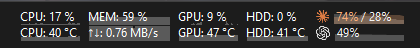

# Better TrafficMonitor AI Usage

A native [TrafficMonitor](https://github.com/zhongyang219/TrafficMonitor) plug-in that displays local Claude and Codex usage history directly in the taskbar widget.

It reads Claude data already stored by the desktop client on the same Windows machine. For Codex, it uses local session records and its own seven-day local sample store for the graph, then starts the installed Codex app-server for the current authenticated account limits; each live point is appended to that store. It falls back to the latest fresh local sample when the app-server is unavailable. It does not open a browser or extract a web-session token.



## Display items

- `Claude Usage`: Claude five-hour and seven-day burn-down history in one compact row.
- `Codex Usage`: Codex seven-day burn-down history, percentage, and time remaining until reset (`d`, then `h`, then `m`; seconds are omitted).

The graph can display either remaining capacity (100% to 0%) or used capacity (0% to 100%). Claude can be monochrome, adaptive, or always colored. A single item in a tall taskbar cell can be centered, placed at the top or bottom, or stretched.

Hovering over the widget shows each window's used and remaining percentage. It also shows the next reset time reported by Claude Desktop or Codex. The Claude reset is shown as a provider-wide `next reset` because the local record does not identify which displayed window it belongs to.

## Install

1. Download the x64 ZIP from the latest GitHub release.
2. Extract it into the directory containing `TrafficMonitor.exe`. The result must contain:

   ```text
   TrafficMonitor\
   ├── TrafficMonitor.exe
   └── plugins\
       └── BetterTrafficMonitorAiUsage.dll
   ```

3. Restart TrafficMonitor.
4. Open the taskbar widget's `Display Settings...` and enable `Claude Usage` and/or `Codex Usage`.
5. Open `Other Functions → Plugin Management`, select `Better TrafficMonitor AI Usage`, and click `Options...` to configure the graphs.

The plug-in currently ships for x64 TrafficMonitor. The DLL architecture must match TrafficMonitor's architecture.

## Local data sources

- Claude Desktop: `%LOCALAPPDATA%\Packages\Claude_*\LocalCache\Roaming\Claude\plan-usage-history.json`
- Codex: `%CODEX_HOME%\sessions\**\*.jsonl`, or `%USERPROFILE%\.codex\sessions\**\*.jsonl` when `CODEX_HOME` is unset

Data is refreshed at most once every 30 seconds. Claude usage history is treated as unavailable after one hour; Claude Desktop normally samples it every 15 minutes but can skip individual polls. Codex seeds its graph from the newest 24 session files (2 MiB per file) and then keeps a compact seven-day local sample history under `%LOCALAPPDATA%\\BetterTrafficMonitorAiUsage\\codex-history.json`.

## Build

Requirements:

- Windows with Visual Studio 2022 Build Tools, the v143 C++ toolset, and MFC
- Stable Rust with the `x86_64-pc-windows-msvc` host/target

Run:

```powershell
powershell -NoProfile -ExecutionPolicy Bypass -File .\scripts\build-release.ps1
```

The installable ZIP and SHA-256 checksum are written to `dist\`.

## Privacy

The usage core only performs bounded local file reads and starts the installed Codex app-server to query the already authenticated local client. It does not transmit credentials, invoke a browser, or access the network itself.

## Author

QQRM

Claude, Anthropic, Codex, and OpenAI names and marks belong to their respective owners. This project is not affiliated with or endorsed by Anthropic, OpenAI, or the TrafficMonitor project.
