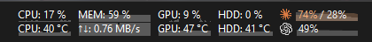

# Better TrafficMonitor AI Usage

A native [TrafficMonitor](https://github.com/zhongyang219/TrafficMonitor) plug-in that displays local Claude, Codex, and ZCode usage history directly in the taskbar widget.

It reads Claude data already stored by the desktop client on the same Windows machine. For Codex, it uses local session records and its own seven-day local sample store for the graph, then requests current account limits directly over HTTPS using the existing Codex OAuth credentials. It never launches or terminates Codex processes. Each live point is appended to the local store; a fresh local sample is used if the request fails. For ZCode (the z.ai coding plan), the taskbar percentages always come from the latest response of z.ai's quota endpoint, requested with the same locally stored API key the ZCode client already uses; the local sample store keeps the graphs and the last known values between requests. It does not open a browser or extract a web-session token.



## Display items

- `Claude Usage`: Claude five-hour and seven-day burn-down history in one compact row.
- `Codex Usage`: Codex seven-day burn-down history, percentage, and time remaining until reset (`d`, then `h`, then `m`; seconds are omitted). It leaves the five-hour column empty so its weekly percentage and reset time line up with ZCode.
- `ZCode Usage`: ZCode (z.ai coding plan) five-hour and weekly credit pools from z.ai's quota endpoint. The compact row uses shared, data-sized columns for `5h% / 7d% / 6d`, aligning the weekly percentage and reset time with Codex without reserving unused space; it is colored by rate period — blue off-peak, violet within an hour of the peak window, red inside it (with an `x3` mark while peak rates apply).

The graph can display either remaining capacity (100% to 0%) or used capacity (0% to 100%). Claude can be monochrome, adaptive, or always colored. A single item in a tall taskbar cell can be centered, placed at the top or bottom, or stretched. Each provider can be hidden in the plug-in options (`Providers` group) — hidden providers are not offered to TrafficMonitor at all; the change applies after TrafficMonitor restarts.

Hovering over the widget shows each window's used and remaining percentage. It also shows the next reset time reported by Claude Desktop or Codex. The Claude reset is shown as a provider-wide `next reset` because the local record does not identify which displayed window it belongs to. For ZCode the tooltip shows the credit counts behind each percentage plus the individual five-hour and weekly-pool reset times.

## Install

1. Download the x64 ZIP from the latest GitHub release.
2. Extract it into the directory containing `TrafficMonitor.exe`. The result must contain:

   ```text
   TrafficMonitor\
   ├── TrafficMonitor.exe
   └── plugins\
       └── BetterTrafficMonitorAiUsage.dll
   ```

3. Restart TrafficMonitor.
4. Open the taskbar widget's `Display Settings...` and enable `Claude Usage`, `Codex Usage`, and/or `ZCode Usage`.
5. Open `Other Functions → Plugin Management`, select `Better TrafficMonitor AI Usage`, and click `Options...` to configure the graphs and the ZCode plan tier.

The plug-in currently ships for x64 TrafficMonitor. The DLL architecture must match TrafficMonitor's architecture.

## Local data sources

- Claude Desktop: `%LOCALAPPDATA%\Packages\Claude_*\LocalCache\Roaming\Claude\plan-usage-history.json`
- Codex: `%CODEX_HOME%\sessions\**\*.jsonl`, or `%USERPROFILE%\.codex\sessions\**\*.jsonl` when `CODEX_HOME` is unset
- ZCode: `%USERPROFILE%\.zcode\cli\db\db.sqlite` (`model_usage` ledger, read-only) and `%USERPROFILE%\.zcode\cli\rollout\model-io-*.jsonl`

Local data is refreshed at most once every 10 seconds. Codex network requests are limited to once per minute, with error backoff up to five minutes, a four-second timeout, bounded input sizes, and no redirects. The existing `%CODEX_HOME%\auth.json` (default `%USERPROFILE%\.codex\auth.json`) is read without modification; token refresh remains the Codex client's responsibility. The current HTTPS usage endpoint is an implementation detail, not a guaranteed public API. Cached samples retain their original timestamps and expire after 20 minutes or at reset. Claude usage history is treated as unavailable after one hour; Claude Desktop normally samples it every 15 minutes but can skip individual polls. Codex seeds its graph from the newest 24 session files (2 MiB per file) and then keeps a compact seven-day local sample history under `%LOCALAPPDATA%\\BetterTrafficMonitorAiUsage\\codex-history.json`. ZCode live percentages come straight from z.ai's `api/monitor/usage/quota/limit` endpoint (five-hour and weekly credit pools with their reset times). When a request fails, the last stored response stays on display until it goes stale (30 minutes for the five-hour lane, six hours for the weekly lane); locally computed percentages are never substituted. Every poll appends to a compact local sample history under `%LOCALAPPDATA%\\BetterTrafficMonitorAiUsage\\zcode-history.json`.

## Build

Requirements:

- Windows with Visual Studio 2022 Build Tools, the v143 C++ toolset, and MFC
- Stable Rust with the `x86_64-pc-windows-msvc` host/target

Run:

```powershell
powershell -NoProfile -ExecutionPolicy Bypass -File .\scripts\build-release.ps1
```

The installable ZIP and SHA-256 checksum are written to `dist\`.

## Privacy

The usage core performs bounded local file reads and calls the OpenAI and z.ai usage endpoints with credentials already stored by their respective clients. HTTPS uses rustls, not Windows SSPI/Schannel. Credentials are not copied into plug-in settings or diagnostics; they are sent only to the respective provider. The plug-in does not start a Codex subprocess, invoke a browser, or modify authentication files.

## Author

QQRM

Claude, Anthropic, Codex, OpenAI, ZCode, and z.ai names and marks belong to their respective owners. This project is not affiliated with or endorsed by Anthropic, OpenAI, Z.ai, or the TrafficMonitor project.
